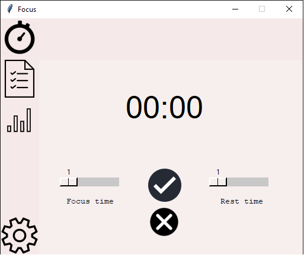
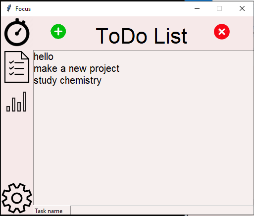
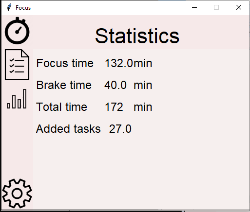
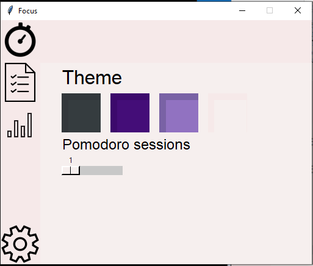

# Focus App
Pomodoro timer and todo list

# Screenshots

 

 

 

# Early Access
This software may be buggy!

# Bugs
On ver0.2 notifications sometimes doesn't work, but very rarely. Its not bug at all but on Linux you need root mode to use ENTER and DELETE in to do list but also notification and sounds in root doesnt work :(

# Requirements
tkinter
 
time
 
keyboard
 
playsound
 
for windows: win10toast
for linux: py-notifier
 

# Changelog
Ver 0.1
First release
 
Ver 0.2 
 
 
-Added settings with themes and pomodoro sessions
 
-visual improvements
 
-bug fixes
 
Ver 0.3
 
-Added pause feature
 
-ui improvements and small bug fixes
 
-fixed sounds
